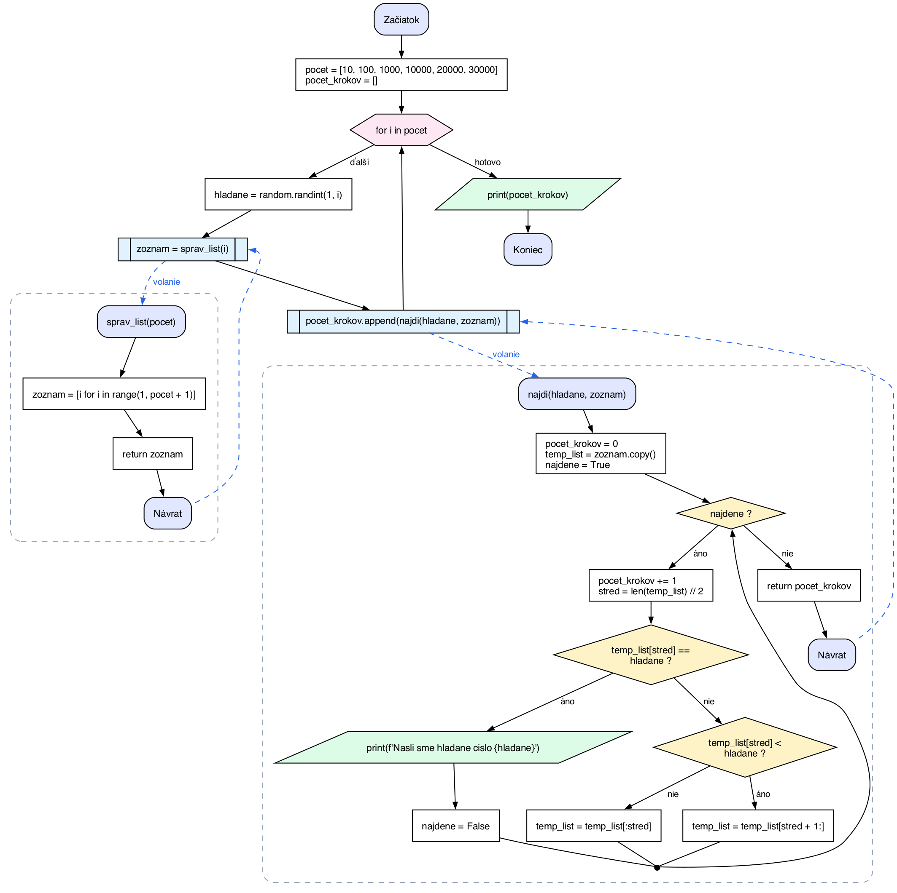

# Flowchart Generator

Upload a Python file, get back flowchart.

At school we have to hand in a flowchart and time-complexity chart for every algorithm we write. Drawing them by hand takes longer than writing the code, so we built a web app that draws them for us.

<p align="center">
  
  <br>
  <em>Generated from a binary search program. Labels are in Slovak by default; this one uses <code>lang=en</code>. Click to enlarge.</em>
</p>

## Features

- **One diagram per file.** The main program and every function are in the same picture.
- **Function calls are connected.** A dashed **call** arrow jumps into the function, and its **Return** end jumps back to the line that called it.
- **Python and Jupyter.** Accepts `.py` files and `.ipynb` notebooks.
- **Handles real control flow.** `if`/`elif`/`else`, `for`, `while` (including `while True`), `break`, `continue`, early `return`, recursion and class methods.
- **Slovak or English labels** (`áno`/`nie` or `yes`/`no`).
- **PNG, SVG or PDF output.** SVG stays sharp at any size, which helps with printing.
- **Your code is never run.** It is only read and analysed. Uploads are processed in memory and nothing is saved. Just in case it is something secret.

### Symbols

| Shape | Meaning | Python |
|---|---|---|
| Rounded box | Start / End / Return | program or function start and end |
| Rectangle | Processing step | assignments, method calls; consecutive lines share one box |
| Parallelogram | Input / output | `print()`, `input()` |
| Diamond | Decision | `if`, `while` condition |
| Hexagon | Loop | `for` |
| Box with side bars | Call to your own function | `x = najdi(...)` |
| Dashed frame | One function | everything inside `def` |

## Project structure

```
backend/
  app.py          FastAPI server
  flowchart.py    flowchart engine (also works as a command-line tool)
  chart.py        time-complexity chart
web/              React + Vite + Tailwind frontend
docs/             images for this README
```

## Running locally

### Requirements

- Python 3.9+
- Node.js 20.19+ or 22.12+
- [Graphviz](https://graphviz.org/download/), the program that draws the diagrams. The pip package alone is not enough.

  ```bash
  brew install graphviz          # macOS
  sudo apt install graphviz      # Ubuntu / Debian
  ```

  On Windows, use the installer from the Graphviz website.

### Backend

```bash
cd backend
pip install fastapi uvicorn python-multipart graphviz matplotlib numpy
uvicorn app:app --reload
```

The API runs at http://localhost:8000. Interactive docs are at http://localhost:8000/docs, where you can upload a file and try it out.

### Frontend

```bash
cd web
npm install
npm run dev
```

The website runs at http://localhost:5173.

## API

| Method | Path | Description |
|---|---|---|
| `GET` | `/health` | Health check, returns `{"status": "ok"}` |
| `POST` | `/create/flowchart` | Upload code, get the flowchart image |
| `POST` | `/create/chart` | Send measured steps, get a time-complexity chart |

### `POST /create/flowchart`

Send the file as `multipart/form-data` in a field named `file`.

| Query parameter | Values | Default |
|---|---|---|
| `lang` | `sk`, `en` | `sk` |
| `format` | `png`, `svg`, `pdf` | `png` |

On success, the response is the image itself, sent as a download named after your file (`bubble_sort.py` → `bubble_sort.png`).

```bash
curl -F "file=@bubble_sort.py" "http://localhost:8000/create/flowchart?lang=en" -o flowchart.png
```

From JavaScript:

```js
const form = new FormData()
form.append('file', file)

const res = await fetch('http://localhost:8000/create/flowchart?lang=sk', { method: 'POST', body: form })
if (!res.ok) throw new Error((await res.json()).detail)
const imageUrl = URL.createObjectURL(await res.blob())   // use in  or a download link
```

Errors come back as JSON, `{"detail": "..."}`:

| Status | When |
|---|---|
| `400` | Not a `.py`/`.ipynb` file, file isn't UTF-8 text, syntax error in the code (the message gives the line), or the file has no code |
| `413` | File larger than 5 MB |
| `422` | Unknown `lang` or `format` value |
| `500` | Graphviz is not installed on the server |

### `POST /create/chart`

Send the input sizes and the number of steps your algorithm took for each size as JSON. The response is the chart image.

| Field | Type | Default | Meaning |
|---|---|---|---|
| `x` | list of numbers | required | Input sizes, 2 to 1000 values |
| `y` | list of numbers | required | Measured steps for each size, same length as `x` |
| `time_complexity` | `O(1)`, `O(log n)`, `O(n)`, `O(n log n)`, `O(n**2)`, `O(n**3)` | `O(n)` | Reference curve to compare with |
| `time_chart` | bool | `true` | Draw the reference curve |
| `label` | string | `Your algorithm` | Legend name of your line |
| `title`, `x_label`, `y_label` | string | automatic | Chart texts |
| `format` | `png`, `svg`, `pdf` | `png` | Image format |

The reference curve is **scaled automatically**. Big-O ignores constant factors, so bubble sort really does about n²/4 swaps, and a plain n² curve would make your line look flat. The API finds the constant that fits your measurements best (least squares) and shows it in the legend, for example `O(n**2) reference: n² / 4`.

```bash
curl -H "Content-Type: application/json" \
  -d '{"x": [10, 100, 1000, 2000, 3000], "y": [14, 2282, 258631, 1024480, 2248086], "time_complexity": "O(n**2)", "label": "Bubble sort"}' \
  http://localhost:8000/create/chart -o chart.png
```

Errors: `400` when `x` and `y` have different lengths, `422` for missing fields or unknown values.

### Production

Set `ENV=production` to turn off the `/docs` page:

```bash
ENV=production uvicorn app:app --host 0.0.0.0 --port 8000
```

The server needs Graphviz installed, just like when running locally.

## Command-line use

The flowchart engine also works without the website:

```bash
python3 backend/flowchart.py my_algorithm.py                 # one file
python3 backend/flowchart.py                                 # every .py / .ipynb in the current folder
python3 backend/flowchart.py my_algorithm.py --lang en --format svg -o out
```

Images are saved to `flowcharts/` unless you set another folder with `-o`.

## Limitations

- `except` blocks are not drawn. The code inside `try` is shown as normal steps.
- A function defined inside another function does not get its own frame.
- Only Python is supported.

## Status

- [x] Flowchart engine
- [x] Flowchart API endpoint
- [x] Frontend upload page
- [ ] Connect the frontend upload to the API
- [x] Time-complexity chart API (`/create/chart`)
- [ ] Time-complexity chart in the frontend

## Team

| Part | Author |
|---|---|
| API | [Demoo2](https://github.com/Demoo2) |
| Frontend | [Matus2220](https://github.com/Matus2220) |
| Flowchart engine | Mostly written by Claude (Anthropic's AI), so credit for that part goes to Claude. Please don't ask us how it works inside. |

## License

[MIT](web/LICENSE)
